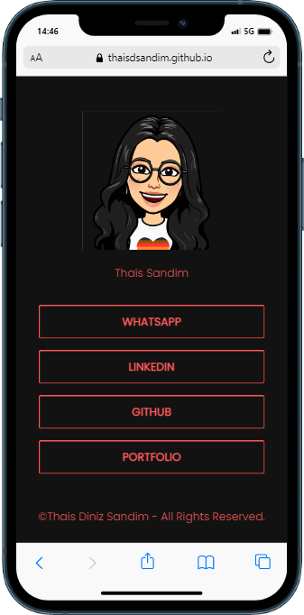

# Social Tree

Project developed for pratice. Social tree is a page with links to my social medias.

 

## :hammer: Functionalities

- Page with links to social medias

## 📁 Project access

You can access the page [here](https://thaisdsandim.github.io/social-tree/).

## ✔️ Tools used

    

## 👩 About me

   

[Thaís Sandim](https://github.com/thaisdsandim), an Administrator who is learning to be a Dev.
